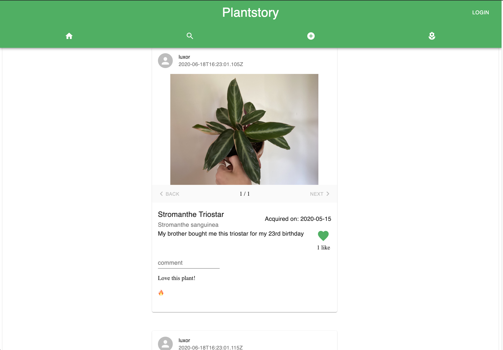
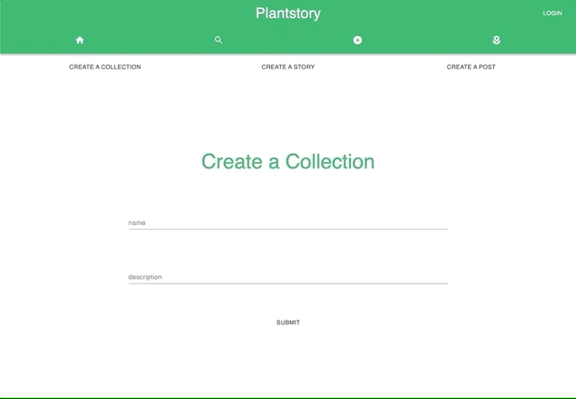

# Plantstory

Social media website that allows users to categorize and share their collection of plants!
A single page web application made with __React__ and designed with __Material UI__, works with the __Ruby on Rails__ [Plantstory API](https://github.com/jguzz/Plantstory_api) to provide data.

A video demo can be found [here](https://youtu.be/SrtUxy3YXQA)!

## Installation 
* Clone down the repo using `git clone https://github.com/jguzz/plantstory-client.git`
* Run `npm install` 
* Run `npm start`
* Ensure that you have the [backend](https://github.com/jguzz/Plantstory_api) running!

## Usage & Features
Plantstory allows users to create _collections_, _Plantstories_, and _posts_.

_Collections_ are where all of your plantstories will live, this is how you will catagorize your collections how you wish. For example indoor, outdoor, bedroom, kitchen, etc.

_Plantstories_ are where each of your plants will live. You can provide some basic information about the kind of plant, and in which collection you would like it to be added to. 

_Posts_ allow you to upload photos with caption to a plantstory. You can add as many posts as you would like to a story, the more the better!

* When viewing a Plantstory you have the ability to navigate through all of the posts. Each post has its own caption, like count, and comments.

<!-- The profile page gives the user access to all of their stories as well as their collections.  -->
* By clicking on the search icon in the top bar you can search through all of the Plantstories on the website.

<!-- ## Future scope
Many features will be added in the future including...
* Dropzone support for photo uploads
* Follow friends -->
## Credits
Code written by Joseph A Guzzardo
- [LinkedIn](https://www.linkedin.com/in/joseph-a-guzzardo/)
- [Github](https://github.com/jguzz)
- [Email](https://mail.google.com/mail/u/0/?view=cm&fs=1&tf=1&source=mailto&to=joseph.a.guzzardo@gmail.com)

## Contribute 
To contribute to Plantstory, follow these steps:
- Fork this repository.
- Create a branch: `git checkout -b <branch_name>`
- Make your changes and commit them: `git commit -m '[commit_message]'`
- Push to the original branch: `git push origin [project_name]/[location]`
- Create the pull request.

Alternatively see the GitHub documentation on [creating a pull request](https://help.github.com/en/github/collaborating-with-issues-and-pull-requests/creating-a-pull-request).

## MIT License

Copyright (c) [2020] [Joseph A Guzzardo]

Permission is hereby granted, free of charge, to any person obtaining a copy
of this software and associated documentation files (the "Software"), to deal
in the Software without restriction, including without limitation the rights
to use, copy, modify, merge, publish, distribute, sublicense, and/or sell
copies of the Software, and to permit persons to whom the Software is
furnished to do so, subject to the following conditions:

The above copyright notice and this permission notice shall be included in all
copies or substantial portions of the Software.

THE SOFTWARE IS PROVIDED "AS IS", WITHOUT WARRANTY OF ANY KIND, EXPRESS OR
IMPLIED, INCLUDING BUT NOT LIMITED TO THE WARRANTIES OF MERCHANTABILITY,
FITNESS FOR A PARTICULAR PURPOSE AND NONINFRINGEMENT. IN NO EVENT SHALL THE
AUTHORS OR COPYRIGHT HOLDERS BE LIABLE FOR ANY CLAIM, DAMAGES OR OTHER
LIABILITY, WHETHER IN AN ACTION OF CONTRACT, TORT OR OTHERWISE, ARISING FROM,
OUT OF OR IN CONNECTION WITH THE SOFTWARE OR THE USE OR OTHER DEALINGS IN THE
SOFTWARE.
